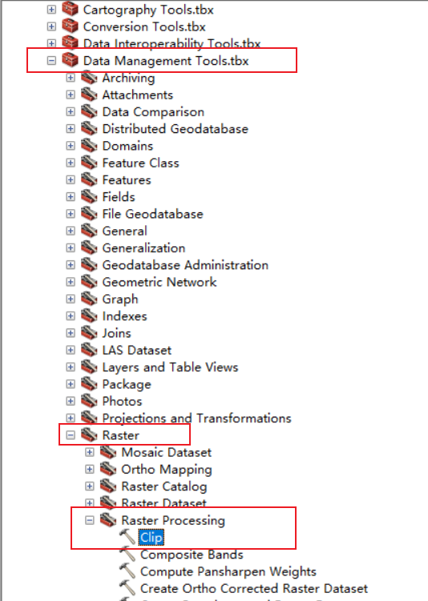

# 地理知识
## 地理空间数据
1. 点线面体数据
2. 矢量数据和栅格数据
   - 栅格数据：即由像素点构成的数据 tif
   分类：
   离散栅格
   连续栅格（如DEM数据）
   优点：数据结构简单，易于理解，占用空间小，空间分析效率较高；
   缺点：精度与数据量大小相悖，不能存储多个属性
   - 矢量数据：shp:shape形状文件  prj:projection投影文件  dbf:data base file数据库文件 shx:shape index索引文件 （一般导入arcGIS中的是shp文件，但shp文件需要依赖其他6个文件）
   分类：
   无位相模型，又名面条模型（Spaghetti Model），只存储点数据，线和面由点连接而成
   拓扑模型（Topological Model）
   优点：精度高，属性丰富，数据量小
   缺点：数据结构复杂，不方便表示连续型数据
   - 矢栅转换
   

3. 地理坐标：以经纬度来表示 如WGS-84坐标系 CGS-2000
   投影坐标：以千米/单位来表示 
4. POI数据：点数据（包含名称、经度、纬度、地址等）
5. 对于实景三维建设技术，需要的空间数据包括：数字高程模型（DEM），数字表面模型（DSM），数字正射影像（DOM）、真正射影像（TDOM）、倾斜摄影三维模型、激光点云等。
   [各种数据简介](https://zhuanlan.zhihu.com/p/633029579)
6. UDM2数据：云层等其他气象会对地球观测数据的正确性产生影响。它们可以隐藏图像中的有用信息。因此产生了UDM2数据类型。
   UDM2是由Planet开发的一种数据类型，它提供了格式化为8波段GeoTIFF格式的有价值的信息。UDM2GeoTIFF中的每个波段对应于不同类别的像素，而另外两个波段则提供补给信息。
   UDM2.1将图像中的每个像素分类为清晰、云、雾、云影或雪。每张发布的 PlanetScope 或 SkySat 图像都有一个相应的 UDM，格式为8波段GeoTIFF，其中每个波段映射到不同的类别，另外还有两个提供附加信息的附加波段。
7. DEM数据：数字高程模型（Digital Elevation Model），是通过有限的地形高程数据实现对地面地形的数字化模拟（即地形表面形态的数字化表达）。它是用一组有序数值阵列形式表示地面高程的一种实体地面模型，是数字地面模型(Digital Terrain Model，简称DTM)的一个分支，其它各种地形特征值均可由此派生。
   
8. 

## 常用空间数据获取

1. 国测局（已经注册不了了）
2. osm
3. 地理空间数据云
4. usgs
5. nasa

## GIS坐标系统
1. 坐标系可为地球表面某一特定地点或区域提供共同的沟通基础。注意两个关键问题：一是要了解使用何种投影；二是将正确的坐标系信息与数据集相关联。
2. 地理坐标系：使用经度和纬度来引用一个点
   
   地心坐标系（如WGS1984坐标系）：以地球地心为原点的旋转椭球体表面（基准面）。
   参心坐标系（如北京54坐标系、西安80坐标系）：他们是以某一些特定位置与地球表面相匹配（如北京和西安），并以此确定椭球体球心以及基准面。
   
3. 投影坐标系：
   地图投影
   
   投影方法
   
   常用投影：
   - 墨卡托投影：由于投影是基于椭球面，而椭球面（基准面）需要由地理坐标系指定，常用的为WGS84
   
   - 横轴墨卡托投影：一次只投影与圆柱面相切的经线所在区域（6°、3°等）
   
   坐标的偏移和带号：为了不用负值
   
   - 通用横轴墨卡托投影：不是用极点与圆柱面相切，而是使用南纬80°和北纬84°与圆柱面相切，这样会出现两条切线，
   
   
   - 兰伯特投影、阿尔伯斯投影
   
   - GCJ-02和BD-09：GCJ-02是国测局为了保护隐私而要求使用的加密坐标系，而BD-09是百度在GCJ-02基础上再加密形成的坐标系
4. 几何校正
   如果某一数据集的坐标不正确，可以通过几何校正来确定正确的坐标系。几何校正通过仿射变换、相似变换、二次变换等功能进行坐标系转换和坐标误差改正。
   几种情况：
   
   矢量化过程
   
5. 

## 插值分析方法
1. 样条函数插值法
   
2. 反距离权重插值法：通常用于气象科学中
   
3. 克里金法
   
   几种模型
          
   
# arcGIS使用
## 数据
1. arcGIS使用的数据格式
   
## arcGIS布局
1. 自行添加工具条
   在工具条的空白区域右键
   
2. 数据视图和布局视图
   
3. 加载数据
   - 使用添加数据按钮（可以多选）
   
   - 使用catalog加载数据
   
   点击connect to folder即可将数据所在的文件夹加入到catalog中
4. list of select界面，将物体分为selected，selectable和not selectable三类
   
   对于不可选择的物体，select features按钮是灰色的
   
5. 查看属性
   右键物体->选择open attribute table就可以看到物体了
   
   
   下方两个按钮一个表示展示该图层的所有属性，一个表示展示图层中选中的物体的属性
6. 当图片被移出视图时，将视图移到图片正中央：点击full extent
   
7. 查看图片波段数
   
   
8. 通过识别工具获取图片属性
   先点击识别工具图标，然后再点击想要识别的区域，就会弹出属性窗口
   
9.  

## arcGIS使用技巧
1. arcGIS在运行时产生的数据会保存在数据库中
2. arcGIS默认将地图保存为mxd后缀文件
3. 保存地图的部分区域：
   选择布局视图 
   打开标尺界面：在自定义->AcrMap选项->布局视图->勾选格网/标尺的显示按钮
   制定页边距：在标尺上点一下即可设置页边距
   使用放大工具放大到你要保存的区域：点击放大工具->左键框选
   
   文件->导出地图
4. 让图形不可选择：在table of contents界面中->点击层级->点击如下按钮即可将图形变为不可选择
   
5. 让图片按照属性变得五颜六色：
   右击table of content中的图片->选择properties->选择符号化->选择分类->value field选择想要划分的属性->点击确定
   
6. 创建一个shp文件：catalog->在某个文件夹下右键->new->shp->feature type选择你想要创建的要素(point, polyline等)
   
   技巧：让新建的shp文件与目标图片拥有相同的坐标系：点击edit->选择add coordinate system->import->选择目标图片->确定
7. 合并图片
   - 打开要合并的两张图片
   - 选择“镶嵌到新栅格”工具
   
   - 选择需要合并的图片与输出位置，并根据自己的需要选择镶嵌运算符以及数据类型
   - 注意事项：因为程序默认的像素类型为8_BIT_UNSIGNED，意为合成值范围在0-255，且不考虑正负号。若合并后的图片有很多白区，说明原始拼接图片的数据大于255；若有大片黑色，说明原始拼接数据存在负值。需要根据图片数据大小设置合适的像素类型。
   
   
8. 裁剪图片
   - 根据掩膜图片裁剪（将图片裁剪为掩膜图片的大小）
   
   - 使用裁剪工具裁剪
   
   
9. 左键旋转，中键放大缩小
10. 去除tif影像黑边
   - tif RGB去除黑边
   首先选中“复制栅格”工具
   
   - 使用识别工具获取黑边的属性（对于RGB图像就是其RGB属性）
   

## arcscene使用
1. 使用arcScene创建地形图
   - 首先导入卫星影像图和高程图，记得查看图片是否进行了投影（方法为查看单位是否为米）
   - 右键卫图，在symbology处将Apply Gamma Stretch取消掉（不知道为什么）
   
   - 右键卫图，在基本高度栏选择“在自定义表面浮动”，自定义表面选择高程图
   - 如果想要起伏效果更明显，右击图片，选择properties，然后将base height的Elevation from features的custom调大一些即可
   
   - 制作边线（注意应该选择高程图来制作图像的边线，同时，如果修改了卫星遥感图的起伏效果，也需要修改边线的custom值）
   
   
   - 选中边线，右键，选择properties，extrusion，按图所示修改即可
    

## cityEngine
1. cityEngine：先创建一个工程，工程中包括如下文件：
   
   其中：assets文件夹存放模型和纹理贴图，data文件夹存放shp、dxf、osm数据等（如建筑、道路、湖泊），image存放图片，map存放地图tif等（如卫星影像），models文件夹存放模型和贴图（如fbx、obj、3ws）、rules文件夹存放规则文件（cja）
2. 将arcgis的数据导入cityengine：
   - 首先创建一个scene，选择坐标系（要与arcgis中数据的坐标系保持一致）
   - 然后将遥感影像和高程数据放到map文件夹，将shp文件放到data文件夹（注意导入shp文件时一些依赖文件也要一起导入）
   - 将卫星影像拖入，选择“地形导入”
   
   - 高度地图file选择高程图片
   
   - 其他数据也直接拖入即可（如建筑数据等）

## 做一张中国行政区划图
1. 导入经纬度数据
2. 导入全球land
3. 导入国界线
4. 导入中国地图
5. 导入河流
6. 导入海域疆界线
7. 修改点线面的显示
8. 修改坐标系：双击/右击图层->选择属性->选择Asia_Lambert_Conformal_Conic->确保Central_Meridian为105度->标准纬线为20度到50度—>点击确定
9. 插入指北针，比例尺，图例，标题
10. 添加南海：插入数据框->右击数据框->选择属性，背景改为白色->再将之前的数据复制进去->修改坐标系->放大到南海区域->添加标题（南海诸岛）

## 处理气象数据（netCDF/nc格式）
1. 在工具箱中找到Multidimension tool->“创建NetCDF栅格图层”工具
2. 变量:sst表示海洋表面温度   X维度：lon    y维度：lat           输出栅格：sst_Layer
3. 选择想要的时间：还是在Multidimension tool->选择”按维度选择“->选择要改变的栅格->修改尺寸处time的值即可换到对应的时间

4. 保存图层文件：右击图层->另存为图层文件
   使用图层文件：对新打开的图层->点击该图层-符号系统->已分类->找到刚刚保存的图层文件->点击添加 

## 处理xy数据
1. 文件->添加xy数据->找到文件位置(.txt)->右键导入的文件->选择“显示xy数据”->x为经度，y为纬度，z为高度，输入坐标的坐标系为该文件所使用的坐标系

2. 处理完后可以导出
   
## 矢量化与编辑操作
1. 配准：对于未定义坐标系且自己也不知道坐标系的图进行坐标系配准
   首先使用定义投影工具：toolbox->projetion->define projection，定义图片的投影方式
   然后用已知坐标的图来配准。一般道路上会有控制点（用红漆标记的点），无人机拍摄时会拍摄到：工具栏右键->选择地理配准工具->点击添加控制点->将控制点的坐标修改为希望在已知坐标的图中的位置->修改完成后选择校正（rectify），保存为.tif格式
   
   
   
2. 矢量化：(操作有些复杂，暂时用不到，以后再学)
   [视频在此](https://www.bilibili.com/video/BV1w54y1a79R?p=39&vd_source=587b2a305b836b2ee84d8ff1b4c49caa)
