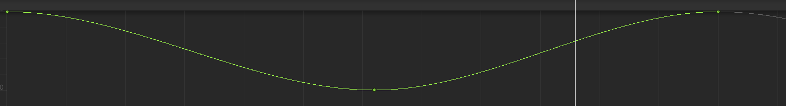
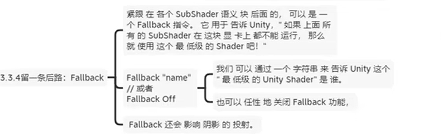

## 说在前面
### 将unitypackage导入后，还需要导入其他资源
1. 导入XCharts(这是用于在Unity中绘制图表的包)
   - [官网](https://xcharts-team.github.io/)
   - 可以使用URL导入，URL如下：https://github.com/XCharts-Team/XCharts.git
2. 将WorldScene、CountyScene、CropScene加入到构建设置中
   先打开构建设置
   
   依次打开scene文件夹下的各个场景，然后点击add_open_scene将其加入场景即可
    
3. 修改后端服务器地址
   打开Scripts/NetworkConnectionHelper.cs文件，将服务器地址改为你运行的后端服务器所在的地址
   
4. 后端使用django，前端使用vue+nginx的方式，如果只是在unity里跑，可以不用配置前端，直接运行unity就可以
5. 之前还做了一个vue实现的[中国地图](https://github.com/Kakoyi945/ChinaMap)，不过没有将unity项目和它整合起来，如果你要用这个中国地图的话，可以将Unity中的WorldScene删掉，然后将vue和Unity结合起来。

## 之前看过的一些Unity学习课程
### 入门视频
- [【siki学院】零基础入门Unity3D - 教你做古迹探险类游戏【已完结】](https://www.bilibili.com/video/BV1xW41197HX/?spm_id_from=333.999.0.0&vd_source=587b2a305b836b2ee84d8ff1b4c49caa)
- [通过案例驱动学习UGUI-2022宇宙最简单教程](https://www.bilibili.com/video/BV1ta411Q7Zu/?spm_id_from=333.999.0.0&vd_source=587b2a305b836b2ee84d8ff1b4c49caa)
### 进阶视频
- [【数字孪生-教程】UE5+Cesium智慧城市&园区全流程开发-数据篇](https://space.bilibili.com/353171605/favlist?fid=1061279605&ftype=create)
- [Unity语句解释 设置小时分钟昼夜太阳位置（天气插件UniStorm昼夜时间设置）](https://www.bilibili.com/video/BV1Yw411z7dq/?spm_id_from=333.999.0.0)
- [数字孪生开发智慧城市项目实战 unity/WebGL/mysql/Vue/C#](https://www.bilibili.com/video/BV1Fk4y1K7FN/?spm_id_from=333.999.0.0&vd_source=587b2a305b836b2ee84d8ff1b4c49caa)
## unity界面使用技巧
1. 将摄像头与所在视角平行
   选择main camera，选择菜单栏的GameObject，选择其中的Align with view即可
2. 物体的中心：
   center:物体的形心（通过计算得到）
   pivot:物体的原点（用来调整物体的位置）
3. 物体的坐标
   local:物体自己的坐标，会跟着物体的旋转而旋转
   global:画布的坐标，不会随着物体的旋转而旋转
4. 锁定层
   在layers中，对于已经做完的层，可以将其锁上，这样可以防止误移该层
5. 让物体按照步长移动
   按住ctrl移动物体
6. 设置步长
   在菜单栏的edit中的snap setting中设置步长
7. 顶点吸附，控制物体紧挨在一块
   按住v键移动物体
8. 创建新场景
   ctrl+n
9. 围绕物体进行观察
   按住alt，再使用左键就可以对物体进行观察
10. 视野选择
   选择此处
   
   persp为透视视野，iso为正交视野
11. 控制物体旋转
   
12. 复制物体
   ctrl+D
13. 

## unity的package manager使用技巧
1. 位置
   
2. 分类：
   
   其中，In Project表示当前项目中的插件，My Assets表示自己下载的资源，往往是从Unity的Assets商店下载的资源，Built-in是内置资源
3. 获取
   - 从Assets商店下载
   - 从第三方库下载
     
     其中，from disk表示将下载到磁盘中的unitypackage导入，from git URL表示直接从github中导入
4. 删除已经安装的插件：
   对于可以在package manager中remove的直接remove，然后点击edit->Preferences->package manager
    
   其中，My Assets中展示的就是通过Assets商店下载下来的插件在磁盘中的位置；
   进入Asset Store-5.x，其中的文件就是下载的插件

## C#脚本技巧
1. 获取GameObject上的某个组件（包括脚本组件）
   ```csharp
   // 以获取Toggle为例
   public GameObject gameObject;
   private Toggle _toggle = gameObject.GetComponent<Toggle>();
   ```
2. 

## 外部资源导入
### 人物模型+动作：
1. 宝藏网站：https://www.mixamo.com/#/   
2. 下载为fbx for unity模式，具体如下：
   
3. 导入后，需要先在assets处编辑模型，首先将Animation type改为Humanoid
   
   skin weights为绑定骨骼时皮肤的一个配重
   点击Apply，就会生成avatar，如果有预定义好的avatar，可以选择CopyFromOtherAvatar，如下：
   
   导入的人物模型其实是有贴图的，但是贴图必需单独解压出来unity才能识别，因此需要在material选项卡中选择extract texture将其解压出来，如下图：
   
   此时会弹出窗口让你Fix Normal Map，这是因为unity中法线贴图必须转化为指定的格式才能使用，因此它会弹出一个弹窗自动帮你把图片转化为法线贴图，直接选择fix now，如下图：
   
   将人物拖拽到项目中后，人物有animator但没有animation controller，因此创建animator controller并拖拽到人物的animator组件的controller框中
   
   之后编辑该animator controller即可
4. 从blender导入的人物模型需要勾选Model中的Bake Axies Conversion选项，因为unity使用左手系坐标，而blender使用右手系坐标，如下：
   

### obj文件导入
1. obj的3D模型通常包括几个内容：.obj文件（保存mesh），.mtl文件（包含材质和贴图信息，必须确保obj和mtl在同一文件夹下，且文件名对应正确）

### 从其他软件处导入模型
1. 从3DMAX中导出模型并导入到unity中：
   解决VRAY材质无法随着fbx导出的问题：可查看3dmax笔记中“模型的导入导出”部分
2. 

## 游戏制作技巧
1. 制作prefab
   将游戏中创建的物体拖入project，就可以将该物体变为prefab
   再将prefab拖入scene中就可以生成新的GameObject，且修改prefab就可以修改生成的GameObject
   若直接对生成的GameObject进行修改，该字段会变粗，表示该字段不再受prefab影响
2. 消除GameObject与prefab的关联
   右键该物体，在prefab视图下选择Unpack或Unpack completely
3. 保存场景
   创建Scenes目录，然后ctrl+s保存到Scenes目录下
4. 为了方便设计游戏，可以先将人物放进去，这样可以方便对照人物大小进行设计，一般人物大小为一到两个cube高度
5. 在进行UI设计时，可以勾选2D选项，如图：
   
6. 区分中心与轴心(物体旋转所根据的位置)：
   
   举例：给门包裹一层空物体，然后将门的中心与空物体的中心相差一个门宽的距离，这样当给空物体添加动画（旋转90度即开门）时，门就会绕着门轴旋转90度
7. 

## 创建地形Terrain
1. 创建地形
   GameObject->3D Object->Terrain
2. 地形刷
   选择如下按钮：
   
   然后选择你要做的操作，比如改变地形，如下图所示
   
   然后按住鼠标左键移动即可粉刷地形
   使用Opacity改变地形高度变化的快慢
   按住shift粉刷可以降低地形
   smooth height可以使地形变得平滑
3. 绘制地形贴图
   选择paint texture
   
   然后选择edit terrain layer
   
   选择create layer即可
   可以添加多个贴图，第一个贴图会覆盖整个地面，后面的需要单独粉刷
4. 在添加地形贴图时添加法线贴图
   选择使用的地形贴图，然后点击下方的Open
   
   在norm map中添加法线贴图即可
5. 修改贴图的大小
   选择使用的地形贴图，然后点击下方的Open
   在size处调节贴图大小
6. 添加树和草
   选择Add tree
   
   通过tree density选择密度
   按住shift，再用左键刷可以减少树
   选择Paint details->edit details->add grass texture
   通过Opacity修改草的密度
7. 将mesh转化为terrain
   [教程](https://blog.csdn.net/yuyingwin/article/details/80179937)
   [文件下载地址](https://www.lmhpoly.com/tutorials/convert-mesh-to-unity-terrain)
8. 将外部资源下载的树添加到terrain的tree中：
   由于外部资源的模型可能比较复杂，比如一个空的父物体，内部有很多个子物体，每个物体有一个mesh，而在Add tree时，Unity找不到物体的mesh，这样会导致如下报错：
   ```shell
   The tree xxx couldn't be instanced because the prefab contains no valid mesh renderer
   UnityEditor.HostView:OnGUI()
   ```
   正确做法是：
   - 首先给父物体添加组件LOD Group，LOD Group的作用如下：
     [LOD Group的作用](https://zhuanlan.zhihu.com/p/586413318)
     LOD的作用就是设置摄像头在距离物体多远时渲染该物体的哪些模型，这样做可以使得摄像头距离物体较远时少渲染一些模型以减少性能开销
   - 然后将子物体的mesh放到LOD0、LOD1、LOD2中，如下图所示：
     
## camera/light相关操作
1. 调节光的亮度以更容易看清细节
   directional light->indensity->将该值调小
2. directional light：太阳光
   point light: 灯泡
   spot light: 手电筒
3. 光照贴图(light mapping)
   原理：将灯光的阴影提前做出来，然后进行贴图，不需要实时计算灯光效果，这样可以减少性能损耗
   将灯光所在的场景(地形，灯光等)修改为static
   将灯光Object的Mode从Realtime改为Baked(对于火焰光，可以改为Mixed，这样既可以烘焙减少性能损耗，又能提高)
   window->rendering->lighting->settings->generate lighting
4. 火焰效果
   首先建立粒子效果，如下图
   
   创建粒子所对应的材质，修改shader
   shader->mobiles->particles->additive
   将火焰贴图动画粘贴过去，如下图：
    
   将做好的材质指定给粒子系统：选中粒子系统->render->将材质放入其material一栏
   将贴图以动画形式展示：选中粒子系统->texture sheet animation->Tiles改为动画尺寸
   给灯光添加动画：window->animation
5. 控制相机跟随主角移动
   原理：计算出主角和相机的相对距离，然后保持这个距离即可
   先将相机移到离主角合适的位置
   创建脚本，代码如下：
   
6. 通过鼠标控制相机移动（中键控制移动，滚轮控制缩放），代码如下：
   ```csharp
   using System.Collections;
   using System.Collections.Generic;
   using UnityEngine;

   public class MouseOpCameraMovRot : MonoBehaviour
   {
      public enum MouseState
      {
         None,
         MidMouseBtn,
         LeftMouseBtn
      }

      private MouseState _mouseState = MouseState.None;

      private Camera _camera;

      private void Awake()
      {
         _camera = GetComponent<Camera>();   // 获取相机
         if(_camera == null)
         {
               Debug.LogError(GetType() + "camera Get Error");
         }

         GetDefaultFov();
      }

      private void LateUpdate()
      {
         CameraRotate();

         CameraFOV();

         CameraMove();
      }

      #region Camera Rotation

      // 旋转最大角度
      public int yRotationMinLimit = -20;
      public int yRotationMaxLimit = 80;
      // 旋转速度
      public float xRotationSpeed = 250.0f;
      public float yRotationSpeed = 120.0f;
      // 旋转角度
      private float xRotation = 0.0f;
      private float yRotation = 0.0f;

      // 鼠标移动进行旋转
      void CameraRotate()
      {
         if(_mouseState == MouseState.None)
         {
               xRotation -= Input.GetAxis("Mouse X") * xRotationSpeed * 0.02f;
               yRotation += Input.GetAxis("Mouse Y") * yRotationSpeed * 0.02f;

               // 旋转角度y限制修正
               yRotation = ClampValue(yRotation, yRotationMinLimit, yRotationMaxLimit);
               Quaternion rotation = Quaternion.Euler(-yRotation, -xRotation, 0);
               transform.rotation = rotation;
         }
      }

      #endregion

      #region Camera fov

      // fov最大最小角度
      public int fovMinLimit = 25;
      public int fovMaxLimit = 75;
      // fov变化速度
      public float fovSpeed = 50.0f;
      // fov角度
      private float fov = 0.0f;

      // 获取相机的初始视角
      void GetDefaultFov()
      {
         fov = _camera.fieldOfView;
      }

      // 滚轮控制相机视角缩放
      public void CameraFOV()
      {
         // 获取鼠标滚轮的滑动量
         fov += Input.GetAxis("Mouse ScrollWheel") * Time.deltaTime * 100 * fovSpeed;

         // fov限制修正
         fov = ClampValue(fov, fovMinLimit, fovMaxLimit);

         // 改变相机的fov
         _camera.fieldOfView = (fov);
      }
      
      #endregion

      #region Camera Move

      private float _mouseX = 0;  // X方向上鼠标的移动
      private float _mouseY = 0;  // Y方向上鼠标的移动
      public float moveSpeed = 1;

      // 中键控制拖动
      public void CameraMove()
      {
         if(Input.GetMouseButton(2)) // 检测鼠标中键按下的每一帧，0为左键，2为右键
         {
               _mouseX = Input.GetAxis("Mouse X");
               _mouseY = Input.GetAxis("Mouse Y");

               // 相机位置的偏移量（Vector3类型，通过向量的加法得到）
               Vector3 moveDir = (_mouseX * -transform.right + _mouseY * -transform.forward);
         
               // 限制y轴的偏移量
               moveDir.y = 0;
               transform.position += moveDir * 0.5f * moveSpeed;
         } else if(Input.GetMouseButtonDown(2)) // 检测鼠标中键按下的那一帧
         {
               _mouseState = MouseState.MidMouseBtn;
               Debug.Log(GetType() + "_mouseState = " + _mouseState.ToString());
         } else if(Input.GetMouseButtonUp(2))
         {
               _mouseState = MouseState.None;
               Debug.Log(GetType() + "_mouseState = " + _mouseState.ToString());
         }
      }

      #endregion

      #region  tools ClampValue

      // 值范围值限定
      float ClampValue(float value, float min, float max)
      {
         if(value < -360)
               value += 360;
         if(value > 360)
               value -= 360;
         // 限制value的值在min和max之间，如果value小于min，则返回min，如果大于max，则返回max，否则返回value
         return Mathf.Clamp(value, min, max);
      }

      #endregion
   }

   ```
7. 

## 刚体及其运动
1. 添加刚体
   选择物体->在inspector中选择Add component->rigidbody
2. Drag：阻力
   Angular Drag：旋转阻力
   Mass：惯性，质量越大，惯性越大
3. 添加碰撞器
   选择物体->在inspector中选择Add component->xx collider
   注：一般unity自带的物体（sphere,cube等）会有自己的碰撞器
   collider种类：
   box collider
   sphere collider
   capsule collider
   mesh collider等
   其中mesh collider最耗费性能，因为它会根据物体创建网格，添加mesh collider时需要与mesh filter保持一致
4. 添加碰撞函数
   对已经添加碰撞器的物体添加脚本，在脚本中创建一个函数，如下：
   
   注：两个静态Collider无法发生碰撞
5. 获取对方的碰撞器，名字，tag
   
6. 添加触发器（触发器与碰撞器的区别在于，触发器是可穿透的，碰撞器是不可穿透的）
   将碰撞器变为触发器
   
   添加触发函数
   

## 导航系统
1. 确保Unity中有AI Navigation
   如何下载：window->package manager->将根目录改为unity registry->查找AI Navigation并下载
2. 导航网格烘焙
   (1)window->ai->navigation(obsolete)
   (2)确保环境(包括地形，障碍物灯)的navigation static被勾选上：选中环境，在navigation(obsolete)中选择object选项卡，将navigation static选中
   (3)在bake选项卡中选择bake
   
3. 其他事项
   navigation static弃用：
   
   让某物可以穿过：将该物体的navigation static取消掉，重新烘焙
   让可行走区域更靠近障碍物：选中该物体，在navigation(obsolete)中，选择bake选项卡，将agent radius值调小，重新烘焙
   让某物上方也不可行走：选中该物体，在navigation(obsolete)中，选择object选项卡，将navigation area选为not walkable，重新烘焙
4. 给主角添加nav mesh agent组件
5. 添加脚本控制主角移动
   创建脚本，将脚本赋给主角Object
   通过鼠标点击获取位置原理：鼠标点击某个点，在这个点发射射线，让射线与地面某个点发生碰撞，然后获取这个点的位置即可。这种情况下点击环境外的位置无法获取位置，因为无法发生碰撞。代码如下：
   
   控制角色到达点击的位置原理：将角色的nav mesh agent改为点击的位置，AI通过导航网格可以自动避开障碍物，到达指定位置。代码如下：
   
   将nav mesh agent组件拖拽到定义的agent变量中
   修改nav mesh agent的angular speed可以提高人物转向的速度

## 动画
1. 给角色添加动画(待机，走路，跑步等)
   创建一个animator controller
   将该controller赋值给hero的animator组件
   选中hero->打开window->animation->animator
   将idle动作先放入编辑区(成为默认动作)，如图：
   
   再将walk,run两个动作放入animator编辑区
   添加参数speed，如下图：
   
   添加从idle到walk的转换线，选中转换线，点击+号将speed参数添加到Conditions中，再将speed条件改为大于等于0，如下图：
   
   再添加从walk到idle的转换线，选中转换线，将speed条件改为小于0
   选中转换线，将HasExitTime取消，因为动作的切换可能随时发生
   
   run和walk的转换同理
   由于自己定义的speed参数不会自动赋值，需要在角色控制的脚本中(hero.cs)进行赋值，代码如下：
   
2. 给动画添加曲线（如小球从下落到弹起的过程中速度的变化）
   打开Animation窗口，点击要编辑的物体，会自动显示绑定在该物体上的动画(关键帧序列)，点击下方的Curve按钮进入曲线界面，如下：
   
   缩放曲线y轴：按住shift+滑动鼠标滚轮
   缩放曲线x轴（时间）：滑动滚轮
   曲线上有一些关键点，如图：
   
   每个关键帧对应曲线上的关键点
   添加关键点：双击曲线上某个点（也将在这条曲线对应的属性的时间轴上添加关键帧）
   删除关键点：框选该点，按下delete键即可删除
   选中关键点（框选），右键即可对点进行编辑
3. 给动画转换添加trigger，与1中添加speed类似
   例如添加当用户靠近时开门的动作：添加一个PlayerProximited参数，然后将DoorClosed到DoorOpen两个动画之间的连线的HasExitTime取消勾选，并添加上这个trigger，最后给门添加碰撞体积，当碰撞时就让trigger触发
4. 添加碰撞体：详见刚体及其运动一章
5. 控制动画不循环播放：找到动画的animation，将Loop Time的勾选取消即可
   
6. 

## UGUI基础
1. 创建canvas：
   
   将Scene区域的视图改为2D
   
2. 文本控件
   字体导入：
   创建文件夹fonts，将ttf文件放入fonts，点击Text游戏物体，在font assets中选择新导入的字体
   
3. 图片控件
   在assets中创建texture文件夹，将需要的图片放入，同时将图片中texture type改为Sprite(2D and UI)
   
   将图片拖入图片控件的source image栏中
   图片控件中的Raycast Target勾选上表示，当鼠标的射线碰撞到图片时，会触发事件
4. 按钮控件
   按钮控件的按钮组件中可以设置按钮不同状态下的颜色(按下，选中等)
   按钮组件中还有一个OnClick部分可以设置按下按钮后触发的事件，这里先选择点击后要影响的游戏物体，然后选择方法
   创建按钮控件也可以先创建图片控件，再在图片控件中添加按钮组件，这样可以让按钮点击后对其他物体产生影响
   注：按钮控件的OnClick的函数可以添加参数，但只允许添加一个参数
5. 锚点
   控件相对位置的参考点，控件的小圆圈就是控件的原点，所谓相对位置就是锚点与控件原点的相对位置
   对于背景图，为了避免图片因为界面尺寸的变化而变化，要将image的锚点设置为界面的四个角
   
6. 输入框控件
   对于输入框控件，如果希望输入内容为密码类型（*号表示），选中输入框控件，将content type改为password
   C#获取输入框内容：首先编写如下脚本，然后将输入框控件拖入InputField对象
   
7. 单选按钮控件
   选择Toggle控件
   将多个单选按钮变为一组（例如多选一的情况），则先将多个单选框用一个空物体包裹起来，然后在空物体上添加Toggle Group组件，并将该空物体赋值给每个单选按钮的IsOn下方的Group变量
   注：Toggle中，IsOn下方的Gaphic存放的就是勾选中后出现的物体（比如勾勾）
      当物体被选中时，会触发IsOn下方的OnValueChanged设置的函数
8. 滑动器（slider）
   设置边框（对于按钮或者滑动器，当进行拉伸时，希望边缘不被影响，只是长度变长，就需要设置边框）：
   首先若没有安装边框编辑器，需要在Package Manager中安装2D Sprite
   
   点击图片->点击Sprite Editor->设置边框->点击Apply
   再将图片应用于滑动器即可
   滑动器还可以修改填充方式，将
9. 滚动器（scroll bar） 
10. 下拉菜单（drop box）
11. 面板(Panel)

## UGUI技巧
1. UI设计原则：UI的层级关系应该与UI特效分开，即触发UI特效的物体不必是最外层的物体
2. 对于button，如果希望触发该button的图片来自别的地方（比如在button上方的图层），可以通过修改Target Graphic为button上方图层来改变
3. 创建新场景：file->new scene->save scene as
4. 制作血条技巧：创建一个背景Bar,再Bar在里面创建一个空槽Bar，再在空槽Bar上创建一个血条Bar，然后给背景Bar添加slider组件，将sldier的Fill rect设置为血条bar，将Slider的interactive的勾选去掉
5. 技能冷却效果技巧：创建一个边框图片，再在边框图片下加一个技能图标1，然后复制这个图标得到技能图标2，将技能图标2改为深色，并勾选Maskable，然后将其Image Type改为Filled，就可以通过修改值获得技能冷却效果，如下图：
   
6. 给字体加阴影：给text控件加Shadow
7. 给字体加边框：给text控件加Outline
8. 通过名字寻找寻找子物体(该子物体为Image对象)：
   
9. 获取键盘敲击事件(aplha1为数字1)：
   
   注意：应将该程序段置于Update函数中，这样才可以随时监听
10. 让子物体和父物体的宽高保持一致，即父物体宽高变化，子物体的宽高也跟着变化：将子物体的锚点设置为父物体的四角
11. 让物体以网格状排列：新建一个空物体，在空物体中添加GridLayoutGroup组件，则在空物体中添加的物体将会以网格方式排列
12. 场景复用：将场景中需要的东西变成prefab，即将scene中需要的物体放到assets中，就可以在别的场景中复用了
13. 让列表滑动起来：创建一个空物体，让他与列表的一页保持一致，命名为Window->将列表置于Window中->给Window添加ScrollRect组件->ScrollRect组件中content一栏设置为该列表，这样就可以实现列表滑动
    注：若希望只能上下滑动，则只勾选Vertical；若希望只能左右，则只勾选Horizontal；
        ScrollRect只有在滑动图片等对象时才能触发，因此，滑动空白区域不会使列表滑动，可以在Window上添加一个Image组件，这样就可以滑动了，如图：
   
14. 获取滑动列表滑动的位置：
    在12所建的window中添加脚本，在脚本中定义OnValueChanged函数，如下图。并将该函数赋值给window的Scroll Rect组件的OnValueChanged一栏，这样当滑动列表时，window就会调用该函数。
    
15. 在拖拽列表结束时将列表停在最近一页上：
    整体逻辑同13，不需要将函数指定给ScrollRect组件，但需要保证该脚本能够获得ScrollRect组件。代码如下：
   ```csharp
   using System.Collections;
   using System.Collections.Generic;
   using UnityEngine;
   using UnityEngine.EventSystems;
   using UnityEngine.UI;

   public class NewBehaviourScript : MonoBehaviour, IBeginDragHandler, IEndDragHandler
   {

      private ScrollRect scroll;
      private float[] pageKnot = new float[]{0, 0.3333f, 0.6666f, 1};
      private float targetPos = 0;
      private bool isMoving = false;  // 是否还需要平滑移动，即当当前位置与targetPos距离足够小时，直接将滑动列表的距离设置为targetPos
      private float speed = 7;    // 设置滑动速度

      // Start is called before the first frame update
      void Start()
      {
         scroll = GetComponent<ScrollRect>();    // 获取该物体的ScrollRect组件
      }

      // Update is called once per frame
      void Update()
      {
         if(isMoving)
         {
               // Time.deltaTime即为增量时间，其值为1s/1s内的帧数
               scroll.horizontalNormalizedPosition = Mathf.Lerp(scroll.horizontalNormalizedPosition, 
                  targetPos, Time.deltaTime * speed);   // Lerp是插值函数，用于在两个点之间插值，通过该函数实现平滑移动
               if(Mathf.Abs(scroll.horizontalNormalizedPosition - targetPos) < 0.001)
               {
                  scroll.horizontalNormalizedPosition = targetPos;
                  isMoving = false;   //停止平滑移动
               } 
         }
      }

      public void OnBeginDrag(PointerEventData eventData)
      {

      }

      public void OnEndDrag(PointerEventData eventData)
      {
         float curPos = scroll.horizontalNormalizedPosition; // 得到滑动组件当前的水平位置正则化的结果
         int index = 0;
         float offset = curPos - pageKnot[0]; // 获取当前水平正则位置与第0页的距离
         for(int i = 1; i < 4; i++)
         {
               if(Mathf.Abs(curPos - pageKnot[i]) < offset) // 获取当前水平正则位置与其他页的距离，并找到距离最近的点
               {
                  index = i;
                  offset = Mathf.Abs(curPos - pageKnot[i]);
               }
         }

         targetPos = pageKnot[index];
         isMoving = true;    // 当用户滑动结束后，且确定最终将停在哪一页后，就开始平滑移动
      }
   }

   ```
16.   

## 天气盒子
### 设置环境天空盒
1. 打开天空盒子设置界面
   
2. 选择环境，将material进行修改即可更换天气
   
3. 

### UniStorm使用
1. 导入包->window->unistorm->create weather system
   
   注意需要给Camera添加Main Camera的tag，以及给Terrain添加Player的Tag，因为unistorm通过这两个tag来确定渲染的位置和大小
2. 控制天气变化：
   创建一个新的空物体命名为UniStormController，添加脚本，在脚本中添加函数，代码如下：
   
   然后创建一个UI，添加几个button，每个button表示一种天气，然后将UniStormController拖入button的OnClick，将WeatherChange函数传入，
   在UniStorm的AllWeatherType通过索引获取需要的天气，则给函数传入特定索引值，如下：
   
   
3. 控制时间变化
   前几步同2，在脚本中添加函数，代码如下：
   
   创建一个ScrollBar，将UniStormController拖入ScrollBar的OnValueChanged，将DayTimeChange函数传入即可，UniStorm将0-1之间的小数转化为‘小时-分钟’

## Shader基础
### 综述
1. 渲染流水线：从三维场景出发，最后生成一个在屏幕二维场景的图像
2. 一般分为三个阶段：
   - 应用阶段
     输出渲染图元——点、线、面
     开发者任务：准备好场景数据、剔除不可见物体，设置好每个模型使用的材质(漫反色射、高光反射)、纹理、shader
   - 几何阶段：输出屏幕的顶点信息、处理所有和我们要绘制的几何相关的事物(决定要绘制的图元是什么、怎么绘制、在哪里绘制)
   - 光栅化阶段：使用上一个阶段的数据来阐述屏幕上的像素，并渲染出最终图像
3. GPU-CPU通信：
   
4. GPU流水线：
   
   
5. 概念理解：
   
### Unity Shader基础
1. material和shader
   
2. uinty shader
   
3. shaderlab
   
   当shader无法解决时就调用fallback
   操作过程：
   - 给shader一个名字
     
   - shader树形
     
   - 重要成员：subshader
     
     
     
   - fallback
     
   - 着色器
     
   - 选择
     
   - 答疑
     
     
### 数学基础
1. 笛卡尔坐标系：
   
   左手/右手坐标系：伸出左手/右手前三个手指头(Unity是左手坐标系)
   正向：左手/右手的四根手指弯曲的方向
   
2. 矩阵的几何意义：
   
   使用齐次坐标进行平移和放缩操作：
   

### UnityShader基础
1. 制作一个简单的定点/片元着色器
   - 一个顶点片元着色器包括如下几个部分：
     
   - 步骤：
     首先创建一个material
     再创建一个shader
     编写shader代码，如下所示：
     ```csharp
     // 着色器的名字
      Shader "Custom/shader01"
      {
         Properties  // 自定义的属性
         {

         }
         // 定义了一个子着色器，Unity会尝试使用这个子着色器来渲染对象。如果当前硬件不支持这个子着色器，Unity将尝试使用Fallback指定的着色器。
         SubShader 
         {
            Pass{ // 定义了一个渲染通道，每个子着色器可以包含多个渲染通道
                  CGPROGRAM

                  #pragma vertex vert // 指定顶点着色器函数名为vert
                  #pragma fragment frag // 指定片段（像素）着色器函数名为frag

                  // 定义顶点着色器函数vert，它接收一个位置参数v，并返回一个SV_POSITION，即屏幕空间中的坐标。
                  float4 vert(float4 v:POSITION):SV_POSITION {
                     return UnityObjectToClipPos(v);  // 模型空间转换到裁剪空间
                  }

                  // 定义片段着色器函数frag，它没有接收任何参数，返回一个fixed4类型的值，表示像素的颜色和透明度
                  fixed4 frag(): SV_Target{
                     return fixed4(0.5, 1.0, 1.0, 1.0);
                  }

                  ENDCG
            }
         }
         // 指定如果当前硬件不支持这个子着色器，Unity将使用名为"Diffuse"的备用着色器
         FallBack "Diffuse"
      }
     ```
     将该shader赋值给material，最后将该material放到其他物体上
   - 获取模型数据
     
     其中用a2v来替换vertex函数的形参，即改为: float4 vert(a2v v){}
   - 顶点着色器与片元着色器沟通
     
     ```csharp
      Shader "Custom/shader02"
      {
         Properties
         {
            _Color("Color Tint", Color) = (1,1,1,1)
         }
         SubShader
         {
            PASS{
                  CGPROGRAM

                  #pragma vertex vert
                  #pragma fragment frag

                  uniform fixed4 _Color;

                  struct a2v{
                     float4 vertex: POSITION;
                     float3 normal: NORMAL;
                     float4 texcoord: TEXCOORD0;   // 顶点纹理的原始坐标
                  };

                  struct v2f{
                     float4 pos: SV_POSITION;
                     fixed3 color: COLOR0;
                  };
                  
                  v2f vert(a2v v){
                     v2f o; // 输出
                     o.pos = UnityObjectToClipPos(v.vertex);
                     o.color = v.normal * 0.5 + fixed3(0.5, 0.5, 0.5);
                     return o;
                  }

                  // 将vert的输出作为frag的输入，从而实现信息交流
                  fixed4 frag(v2f i): SV_Target {
                     fixed3 o = i.color;
                     o *= _Color.rgb;
                     return fixed4(o, 1.0);
                  }

                  ENDCG
            }

         }
         FallBack "Diffuse"
      }

     ```
   - 使用属性(放在properties大括号内)
     
   - CG/HLSL语义
     
   - debug
     
   - float,half or fixed
     
   - 
### Unity中的基础光照
1. 散射(scattering)
   
2. 吸收
   
3. 着色
   
   BRDF光照模型
   
4. 标准光照模型
   - 环境光
     
   - 自发光
     
   - 漫反射
     
   - 高光反射
     
5. 去哪里计算光照模型
   
6. 设置环境光
   window->rendering->lighting打开光照设置
   然后就可以看到环境光的设置界面了
7. 实现漫反射
   - 逐顶点的漫反射(在vertex中计算漫反射)
     ```csharp
      Shader "Custom/shader03"
      {
         Properties
         {
            _Diffuse("Diffuse", Color) = (1, 1, 1, 1)   // 设置漫反射的颜色为白色
         }
         SubShader
         {
            PASS
            {
                  // 设置了一个标签，指定这个通道使用的是"ForwardBase"光照模式，这是Unity中用于处理基本光照的模式
                  Tags {"LightMode" = "ForwardBase"}

                  CGPROGRAM

                  #pragma vertex vert
                  #pragma fragment frag

                  // 包含了Unity的Lighting.cginc文件，这是一个包含了光照计算的库
                  #include "Lighting.cginc" 

                  // 在CGPROGRAM代码块中重新定义了_Diffuse属性，以便在着色器代码中使用
                  fixed4 _Diffuse;    

                  struct a2v {
                     float4 vertex: POSITION;
                     float3 normal: NORMAL;
                  };

                  struct v2f {
                     float4 pos: SV_POSITION;
                     fixed3 color: COLOR;
                  };

                  v2f vert(a2v v){
                     v2f o;

                     o.pos = UnityObjectToClipPos(v.vertex);
                     
                     // 计算环境光对物体的影响
                     fixed3 ambient = UNITY_LIGHTMODEL_AMBIENT.xyz;

                     // 将法线从模型空间转换到世界空间并标准化
                     fixed3 worldNormal = normalize(mul(v.normal, (float3x3)unity_WorldToObject));

                     // 获取并标准化世界空间中的光源方向
                     fixed3 worldLight = normalize(_WorldSpaceLightPos0.xyz);

                     // 计算漫反射光照，包括光源颜色、物体颜色和颜色强度(法线与光源方向的点积)
                     fixed3 diffuse = _LightColor0.rgb * _Diffuse.rgb * saturate(dot(worldNormal, worldLight));

                     // 将环境光和漫反射光相加得到最终颜色
                     o.color = ambient + diffuse;
                     
                     return o;
                  }

                  fixed4 frag(v2f i): SV_Target{
                     return fixed4(i.color, 1.0);
                  }

                  ENDCG

            }
         }
         FallBack "Diffuse"
      }
     ```
   - 逐像素的漫反射(在frag中计算漫反射)
     ```csharp
      Shader "Custom/shader04"
      {
         Properties
         {
            _Diffuse("Diffuse", Color) = (1, 1, 1, 1)   // 设置漫反射的颜色为白色
         }
         SubShader
         {
            PASS
            {
                  // 设置了一个标签，指定这个通道使用的是"ForwardBase"光照模式，这是Unity中用于处理基本光照的模式
                  Tags {"LightMode" = "ForwardBase"}

                  CGPROGRAM

                  #pragma vertex vert
                  #pragma fragment frag

                  // 包含了Unity的Lighting.cginc文件，这是一个包含了光照计算的库
                  #include "Lighting.cginc" 

                  // 在CGPROGRAM代码块中重新定义了_Diffuse属性，以便在着色器代码中使用
                  fixed4 _Diffuse;    

                  struct a2v {
                     float4 vertex: POSITION;
                     float3 normal: NORMAL;
                  };

                  struct v2f {
                     float4 pos: SV_POSITION;
                     fixed3 worldNormal: TEXCOORD0;
                  };

                  v2f vert(a2v v){
                     v2f o;

                     o.pos = UnityObjectToClipPos(v.vertex);

                     // 将物体法线转换为世界法线
                     o.worldNormal = mul(v.normal, (float3x3)unity_WorldToObject);
                     
                     return o;
                  }

                  fixed4 frag(v2f i): SV_Target{

                     // 得到环境光对物体的影响
                     fixed3 ambient = UNITY_LIGHTMODEL_AMBIENT.xyz;

                     // 将世界空间的法线正则化
                     fixed3 worldNormal = normalize(i.worldNormal);

                     // 将世界空间的光源方向正则化
                     fixed3 worldLightDir = normalize(_WorldSpaceLightPos0.xyz);

                     // 计算漫反射颜色
                     fixed3 diffuse = _LightColor0.rgb * _Diffuse.rgb * saturate(dot(worldNormal, worldLightDir));

                     fixed3 color = ambient + diffuse;

                     return fixed4(color, 1.0);
                  }

                  ENDCG

            }
         }
         FallBack "Diffuse"
      }
     ```
   - 半兰伯特光照模型：改善暗面颜色一样的问题，这是由于saturate函数将小于0的值直接截断为0导致的，因此半兰伯特采用另一种方法计算光照强度
     ```csharp
      // 计算漫反射颜色
      fixed halfLambert = dot(worldNormal, worldLightDir) * 0.5 + 0.5;
      fixed3 diffuse = _LightColor0.rgb * _Diffuse.rgb * halfLambert;
     ```
   - 
8. 实现高反射
   - 计算方法：
     
   - 逐像素高反射(逐顶点的代码在此基础上改动一下，改动方法于漫反射类似)
     ```csharp
      Shader "Custom/shader06"
      {
         Properties
         {
            _Diffuse("Diffuse", Color) = (1, 1, 1, 1)   // 设置漫反射的颜色为白色
            _Specular("Specular", Color) = (1, 1, 1, 1) // 设置高光反射为白色
            _Gloss("Gloss", Range(8.0, 256)) = 20       // 设置光泽度，影响光的锐利度
         }
         SubShader
         {
            PASS
            {
                  // 设置了一个标签，指定这个通道使用的是"ForwardBase"光照模式，这是Unity中用于处理基本光照的模式
                  Tags {"LightMode" = "ForwardBase"}

                  CGPROGRAM

                  #pragma vertex vert
                  #pragma fragment frag

                  // 包含了Unity的Lighting.cginc文件，这是一个包含了光照计算的库
                  #include "Lighting.cginc" 

                  // 在CGPROGRAM代码块中重新定义了属性，以便在着色器代码中使用
                  fixed4 _Diffuse;    
                  fixed4 _Specular;
                  float _Gloss;

                  struct a2v {
                     float4 vertex: POSITION;
                     float3 normal: NORMAL;
                  };

                  struct v2f {
                     float4 pos: SV_POSITION;
                     fixed3 worldNormal: TEXCOORD0;
                     float3 worldPos: TEXCOORD1;
                  };

                  v2f vert(a2v v){
                     v2f o;

                     o.pos = UnityObjectToClipPos(v.vertex);

                     // 将物体法线转换为世界法线
                     o.worldNormal = mul(v.normal, (float3x3)unity_WorldToObject);
                     
                     // 将物体顶点从物体空间转换为世界空间
                     o.worldPos = mul(unity_ObjectToWorld, v.vertex).xyz;

                     return o;
                  }

                  fixed4 frag(v2f i): SV_Target{

                     // 得到环境光对物体的影响
                     fixed3 ambient = UNITY_LIGHTMODEL_AMBIENT.xyz;

                     // 将世界空间的法线正则化
                     fixed3 worldNormal = normalize(i.worldNormal);

                     // 将世界空间的光源方向正则化
                     fixed3 worldLightDir = normalize(_WorldSpaceLightPos0.xyz);

                     // 计算漫反射光照
                     fixed3 diffuse = _LightColor0.rgb * _Diffuse.rgb * saturate(dot(worldNormal, worldLightDir));
                     
                     // 计算世界空间的反射光角度并正则化
                     fixed3 reflectDir = normalize(reflect(worldLightDir, worldNormal));

                     // 计算世界空间的摄像头角度并正则化
                     fixed3 viewDir = normalize(_WorldSpaceCameraPos.xyz - i.worldPos.xyz);

                     // 计算高反射光照
                     fixed3 specular = _LightColor0.rgb * _Specular.rgb * pow(saturate(dot(reflectDir, viewDir)), _Gloss);

                     fixed3 color = ambient + diffuse + specular;

                     return fixed4(color, 1.0);
                  }

                  ENDCG

            }
         }
         FallBack "Diffuse"
      }
     ```
9. 使用Unity内置函数帮助计算反射
   
   如下示例：
   ```csharp
   // 使用cginc内置函数将世界空间的光源方向正则化
   fixed3 worldLightDir = normalize(UnityWorldSpaceLightDir(i.worldPos));
   // 使用cginc内置函数计算世界空间的摄像头角度并正则化
   fixed3 viewDir = normalize(UnityWorldSpaceViewDir(i.worldPos));
   ```
   
### 基础纹理
1. 单张纹理：
   示例：
   - 首先给物体放入material，并给material放入shader，shader代码如下：
      ```csharp
      Shader "Custom/shader08"
      {
         Properties{
            // 定义材质颜色的属性。这个属性通常用于设置材质的整体颜色或色调（Tint），它会影响材质在渲染时的颜色表现
            _Color("Color Tint", Color) = (1, 1, 1, 1)
            _MainTex("Main Tex", 2D) = "white" {}   // 主纹理，用于贴图
            _Specular("Specular", Color) = (1, 1, 1, 1)
            _Gloss("Gloss", Range(8.0, 256)) = 20        
         }

         SubShader{
            Pass{
                  Tags {"LightMode" = "ForwardBase"}

                  CGPROGRAM

                     #pragma vertex vert
                     #pragma fragment frag

                     #include "Lighting.cginc"

                     fixed4 _Color;
                     sampler2D _MainTex;
                     // _MainTex_ST通常用于计算纹理坐标的变换，以适应不同的平铺和偏移需求。包含四个属性：
                     // x - Tiling U：控制纹理在U轴（水平）方向上的平铺次数。例如，如果一个纹理的宽度是1单位，那么_MainTex_ST.x设置为2将使纹理在宽度上重复两次。
                     // y - Tiling V：控制纹理在V轴（垂直）方向上的平铺次数。与U轴类似，这个值决定了纹理在高度上重复的次数。
                     // z - Offset U：控制纹理在U轴上的偏移量。正值会将纹理向右移动，负值会向左移动。
                     // w - Offset V：控制纹理在V轴上的偏移量。正值会将纹理向下移动，负值会向上移动
                     float4 _MainTex_ST;
                     fixed4 _Specular;
                     float _Gloss;

                     struct a2v {
                        float4 vertex: POSITION;
                        float3 normal: NORMAL;
                        float4 texcoord: TEXCOORD0;
                     };

                     struct v2f {
                        float4 pos: SV_POSITION;
                        float3 worldNormal: TEXCOORD0;
                        float3 worldPos: TEXCOORD1;
                        float2 uv: TEXCOORD2;
                     };

                     v2f vert(a2v v){
                        v2f o;
                        o.pos = UnityObjectToClipPos(v.vertex);
                        o.worldNormal = UnityObjectToWorldNormal(v.normal);
                        o.worldPos = mul(unity_ObjectToWorld, v.vertex).xyz;
                        // 这里，v.texcoord.xy 是顶点的原始纹理坐标，_MainTex_ST.xy 用于平铺，_MainTex_ST.zw 用于偏移
                        o.uv = v.texcoord.xy * _MainTex_ST.xy + _MainTex_ST.zw;
                        // 或者直接调用
                        // o.uv = TRANSFORM_TEX(v.texcoord, _MainTex);
                        return o;
                     }

                     fixed4 frag(v2f i): SV_Target{
                        fixed3 worldNormal = normalize(i.worldNormal);
                        fixed3 worldLightDir = normalize(UnityWorldSpaceLightDir(i.worldPos));

                        // tex2D用于从二维纹理（2D texture）中采样颜色值。这个函数根据提供的纹理坐标（UV坐标）来查找并返回纹理中对应的像素颜色
                        // albedo是物体的反射特性，这里是让纹理的颜色于基础颜色相乘
                        fixed3 albedo = tex2D(_MainTex, i.uv).rgb * _Color.rgb;
                        // 后续全部的内容都要乘以albedo
                        fixed3 ambient = UNITY_LIGHTMODEL_AMBIENT.xyz * albedo;
                        fixed3 diffuse = _LightColor0.rgb * albedo * max(0, dot(worldNormal, worldLightDir));
                        fixed3 viewDir = normalize(UnityWorldSpaceViewDir(i.worldPos));
                        fixed3 halfDir = normalize(worldLightDir + viewDir);
                        fixed3 specular = _LightColor0.rgb * _Specular.rgb * pow(max(0, dot(worldNormal, halfDir)), _Gloss);

                        return fixed4(ambient + diffuse + specular, 1.0);
                     }

                  ENDCG
            }
         }

      }
      ```
   - 再将一个texture放入该shader即可
2. 凹凸纹理：
   - 法线纹理：
     物体空间的法线纹理
     
     切线空间的法线纹理
     
   - 使用切线空间的法线纹理实现凹凸纹理：
     ```csharp
      Shader "Custom/shader09"
      {
         Properties
         {
            _Color ("Color", Color) = (1, 1, 1, 1)
            _MainTex ("Main Tex", 2D) = "white" {}
            _BumpMap ("Normal Map", 2D) = "bump" {} // 法线贴图
            _BumpScale ("Bump Scale", Float) = 1.0  // 控制法线贴图强度
            _Specular ("Specular", Color) = (1, 1, 1, 1)
            _Gloss ("Gloss", Range(8.0, 256)) = 20
         }
         SubShader
         {
            PASS{
                  Tags { "LightMode"="ForwardBase" }

                  CGPROGRAM

                  #pragma vertex vert
                  #pragma fragment frag

                  #include "Lighting.cginc"

                  fixed4 _Color;
                  sampler2D _MainTex;
                  float4 _MainTex_ST;
                  sampler2D _BumpMap;
                  float4 _BumpMap_ST;
                  float _BumpScale;
                  fixed4 _Specular;
                  float _Gloss;

                  struct a2v {
                     float4 vertex: POSITION;
                     float3 normal: NORMAL;
                     float4 tangent: TANGENT; // 指定每个顶点的切线向量
                     float4 texcoord: TEXCOORD0;
                  };

                  struct v2f {
                     float4 pos: SV_POSITION;
                     float4 uv: TEXCOORD0;
                     float3 lightDir: TEXCOORD1;
                     float3 viewDir: TEXCOORD2;
                  };

                  v2f vert(a2v v) {
                     v2f o;
                     o.pos = UnityObjectToClipPos(v.vertex);

                     // o.uv.xy存储了调整后的主纹理坐标，这些坐标将用于在片段着色器中采样主纹理(_MainTex)
                     o.uv.xy = v.texcoord * _MainTex_ST.xy + _MainTex_ST.zw;
                     // o.uv.zw 存储了调整后的法线贴图坐标，这些坐标将用于片段着色器中采样法线贴图(_BumpMap)
                     o.uv.zw = v.texcoord * _BumpMap_ST.xy + _BumpMap_ST.zw;

                     // 以下代码可用在归一化或未归一化情况下使用

                     // 计算从模型空间到切线空间的转换矩阵，这包括世界空间法线、切线和副法线的计算
                     // 副法线(binormal)是与切线和法线垂直的向量,cross函数用于计算两个向量叉乘的结果
                     // v.tangent.w用于翻转双法线，w存储惯用手系，始终为1或-1
                     fixed3 worldNormal = UnityObjectToWorldNormal(v.normal);
                     fixed3 worldTangent = UnityObjectToWorldDir(v.tangent.xyz);
                     fixed3 worldBinormal = cross(worldNormal, worldTangent) * v.tangent.w;

                     // 将世界空间切换到切线空间
                     float3x3 worldToTangent = float3x3(worldTangent, worldBinormal, worldNormal);
                     
                     // 将世界空间的光照方向、摄像头视线方向转换到切线空间
                     o.lightDir = mul(worldToTangent, UnityWorldSpaceLightDir(v.vertex));
                     o.viewDir = mul(worldToTangent, UnityWorldSpaceViewDir(v.vertex));

                     return o;
                  }

                  fixed4 frag(v2f i):SV_Target{
                     fixed3 tangentLightDir = normalize(i.lightDir);
                     fixed3 tangentViewDir = normalize(i.viewDir);

                     // 采样法线纹理
                     fixed4 packedNormal = tex2D(_BumpMap, i.uv.zw);
                     fixed3 tangentNormal;


                     tangentNormal = UnpackNormal(packedNormal); // 将压缩的法线贴图纹理坐标转换回归一化法线向量
                     tangentNormal.xy *= _BumpScale;
                     // 切线空间的法线纹理只存储了xy信息
                     // 假设法线向量为(x,y,z)，它可以由(x,y,0)和(0,0,z)两条边组成，既然法线向量是一条单位向量，
                     // 这两条边构成的三角形又是直角三角形，那么其实只要知道一条边长，就可以用勾股定理计算出另一条边长
                     tangentNormal.z = sqrt(1.0 - saturate(dot(tangentNormal.xy, tangentNormal.xy)));

                     fixed3 albedo = tex2D(_MainTex, i.uv).rgb * _Color.rgb;
                     fixed3 ambient = UNITY_LIGHTMODEL_AMBIENT.xyz * albedo;

                     fixed3 diffuse = _LightColor0.rgb * albedo * max(0, dot(tangentNormal, tangentLightDir));
                     
                     fixed3 halfDir = normalize(tangentLightDir + tangentViewDir);
                     fixed3 specular = _LightColor0.rgb * _Specular.rgb * pow(max(0, dot(tangentNormal, halfDir)), _Gloss);

                     return fixed4(ambient + diffuse + specular, 1.0);
                  }

                  ENDCG
            }
         }
         FallBack "Specular"
      }
     ```
3. 渐变纹理
   - 尽管在一开始，我们在渲染中使用纹理是为了定义一个物体的颜色，但后来人们发现，纹理其实可以用来存储任何表面属性。一种常见的用法就是使用渐变纹理来控制漫反射光照的结果。在之前计算漫反射光照结果的时候，我们都是使用表面法线和光照方向的点积结果与材质的反射率相乘来得到表面的漫反射光照。但有时，我们需要更加灵活的控制光照。使用这种技术，可以保证物体的轮廓线相比于之前使用的传统漫反射光照更加明显，而且能够提供多种色调变化
   - 示例：
   ```csharp
   Shader "Custom/shader10"
   {
      Properties
      {
         _Color ("Color", Color) = (1, 1, 1, 1)
         _RampTex ("Ramp Tex", 2D) = "white" {} // 该纹理通常包含了不同亮度级别的颜色样本，用于映射表面的光照强度
         _Specular ("Specular", Color) = (1, 1, 1, 1)
         _Gloss ("Gloss", Range(8.0, 256)) = 20
      }
      SubShader
      {
         PASS{
               Tags { "LightMode"="ForwardBase" }

               CGPROGRAM

               #pragma vertex vert
               #pragma fragment frag

               #include "Lighting.cginc"

               fixed4 _Color;
               sampler2D _RampTex;
               float4 _RampTex_ST;
               fixed4 _Specular;
               float _Gloss;

               struct a2v {
                  float4 vertex: POSITION;
                  float3 normal: NORMAL;
                  float4 texcoord: TEXCOORD0;
               };

               struct v2f {
                  float4 pos: SV_POSITION;
                  float3 worldNormal: TEXCOORD0;
                  float3 worldPos: TEXCOORD1;
                  float2 uv: TEXCOORD2;
               };

               v2f vert(a2v v) {
                  v2f o;
                  o.pos = UnityObjectToClipPos(v.vertex);

                  o.worldNormal = UnityObjectToWorldNormal(v.normal);

                  o.worldPos = mul(unity_ObjectToWorld, v.vertex).xyz;

                  o.uv = TRANSFORM_TEX(v.texcoord, _RampTex);

                  return o;
               }

               fixed4 frag(v2f i):SV_Target{
                  fixed3 worldNormal = normalize(i.worldNormal);

                  fixed3 worldLightDir = normalize(UnityWorldSpaceLightDir(i.worldPos));

                  fixed3 ambient = UNITY_LIGHTMODEL_AMBIENT.xyz;

                  fixed halfLambert = 0.5*dot(worldNormal, worldLightDir) + 0.5;
                  // halfLambert 是通过计算法线和光照方向的点积得到的，它表示了表面接收到的光照强度。
                  // 然后，使用这个值作为Ramp Texture的UV坐标，通过 tex2D 函数采样纹理，得到对应的颜色值。
                  // 这个颜色值随后被用来调制漫反射光照的颜色
                  fixed3 diffuseColor = tex2D(_RampTex, fixed2(halfLambert, halfLambert)).rgb * _Color.rgb;
                  fixed3 diffuse = _LightColor0.rgb * diffuseColor;
                  
                  fixed3 viewDir = normalize(UnityWorldSpaceViewDir(i.worldPos));

                  fixed3 halfDir = normalize(worldLightDir + viewDir);
                  fixed3 specular = _LightColor0.rgb * _Specular.rgb * pow(max(0, dot(worldNormal, halfDir)), _Gloss);

                  return fixed4(ambient + diffuse + specular, 1.0);
               }

               ENDCG
         }
      }
      FallBack "Specular"
   }
   ```
4. 遮罩纹理
   - 遮罩可以允许我们保护某些区域，使它们免于 某些修改。常见的应用是在制作地形材质时需要混合多张图片，例如表现草地的纹理、表现石子的纹理、表现裸露土地的纹理等，使用遮罩纹理可以控制如何混合这些纹理
   - 使用遮罩纹理的一般流程是：通过采样得到遮罩纹理的纹素值，然后使用其中某个（或几个）通道的值（texel.r）来与某种表面属性进行相乘，这样当该通道的值为0时，可以保护表面不受该属性影响。

### 透明效果
1. 深度测试与深度写入
   - 渲染顺序问题：对于不透明（opaque）物体，不考虑它们的渲染顺序也能得到正确的排序效果，这是由于强大的深度缓冲（depth buffer，也被称为z-buffer）的存在。
   - 深度缓冲原理：它的基本思想是：根据深度缓冲中的值来判断该片元距离摄像机的距离，当渲染一个片元时，需要把它的深度值和已经存在于深度缓冲区中的值进行比较（如果开启了深度测试），如果它的值距离摄像机更远，那么说明这个片元不应该被渲染到屏幕上（有物体挡住了它）；否则这个片元应该覆盖掉此时颜色缓冲中的像素值，并把它的深度值更新到深度缓冲中（如果开启了深度写入）
   - 当使用透明度混合时，我们必须关闭深度写入（ZWrite），否则半透明物体后面的物体将会被剔除
   - 基于上面两点，渲染引擎一般都会先对物体进行排序，再渲染，常用的方法是：
    （1）先渲染所有不透明物体，并开启它们的深度测试和深度写入。
    （2）把半透明物体按它们距离摄像机的远近进行排序，然后按照从后往前的顺序渲染这些半透明物体，并开启它们的深度测试，但关闭深度写入。
2. 透明度测试和透明度混合
   Unity通常使用两种方法实现透明效果
   - 透明度测试：它是一种“霸道极端”的机制，只要一个片元的透明度不满足条件（通常是小于某个阈值），那么它对应的片元就会被舍弃。被舍弃的片元不会再进行任何处理，也不会对颜色缓冲产生任何影响；否则就会按照普通的不透明物体的处理方式来处理它，即进行深度测试、深度写入等。也就是说，透明度测试是不需要关闭深度写入的，它和其它不透明物体最大的不同是它会根据透明度来舍弃一些片元。虽然简单，但是它产生的效果也很极端，要么完全透明，即看不到，要么完全不透明，就像不透明物体那样。
   - 透明度混合：它会使用当前片元的透明度作为混合因子，与已经存储在颜色缓冲中的颜色进行混合，得到新的颜色。但是透明度混合需要关闭深度写入，这使我们要非常小心物体的渲染顺序。需要注意的是，透明度混合只关闭了深度写入，但没有关闭深度测试。这意味着当使用透明度深度混合渲染一个片元时，还是会比较它的深度值与当前深度缓冲区中的深度值，如果它的深度值距离摄像机更远，那么就不会再进行混合操作。这一点决定了，当一个不透明物体出现在一个透明物体前面，而我们先渲染了不透明物体，它仍然可以正常地遮住不透明物体。也即是说，对于透明混合度来说，深度缓冲是只读的
3. UnityShader的渲染队列
   Unity为了解决渲染顺序的问题提供了渲染队列（render queue）这一解决方案
   
4. 如果想要通过透明度测试实现透明效果，代码示例如下：
   ```csharp
   Shader "Custom/shader11"
   {
      Properties{
         // 定义材质颜色的属性。这个属性通常用于设置材质的整体颜色或色调(Tint),它会影响材质在渲染时的颜色表现
         _Color("Color Tint", Color) = (1, 1, 1, 1)
         _MainTex("Main Tex", 2D) = "white" {}   // 主纹理,用于贴图
         _Cutoff("Alpha Cutoff", Range(0, 1)) = 0.5 // 决定调用clip进行透明度测试时使用的判断条件
      }

      SubShader{
         // RenderType标签可以让Unity把这个shader归入到提前定义的组,即TransparentCutout
         // 把IgnoreProjector设置为True,可以让这个shader不受投影器的影响
         Tags{"Queue"="AlphaTest""IgnoreProjector"="True""RenderType"="TransparentCutout"}
         Pass{
               Tags {"LightMode" = "ForwardBase"}

               CGPROGRAM

                  #pragma vertex vert
                  #pragma fragment frag

                  #include "Lighting.cginc"

                  fixed4 _Color;
                  sampler2D _MainTex;
                  float4 _MainTex_ST;
                  fixed _Cutoff;

                  struct a2v {
                     float4 vertex: POSITION;
                     float3 normal: NORMAL;
                     float4 texcoord: TEXCOORD0;
                  };

                  struct v2f {
                     float4 pos: SV_POSITION;
                     float3 worldNormal: TEXCOORD0;
                     float3 worldPos: TEXCOORD1;
                     float2 uv: TEXCOORD2;
                  };

                  v2f vert(a2v v){
                     v2f o;
                     o.pos = UnityObjectToClipPos(v.vertex);
                     o.worldNormal = UnityObjectToWorldNormal(v.normal);
                     o.worldPos = mul(unity_ObjectToWorld, v.vertex).xyz;
                     o.uv = TRANSFORM_TEX(v.texcoord, _MainTex);
                     return o;
                  }

                  fixed4 frag(v2f i): SV_Target{
                     fixed3 worldNormal = normalize(i.worldNormal);
                     fixed3 worldLightDir=normalize(UnityWorldSpaceLightDir(i.worldPos));
                     fixed4 texColor=tex2D(_MainTex,i.uv);
                     //Alpha text
                     clip(texColor.a-_Cutoff);
                     //Equal to
                     //if((Texcolor.a-_Cutoff)<0.0){discard};
                     fixed3 albedo=texColor.rgb*_Color.rgb;
                     fixed3 ambient=UNITY_LIGHTMODEL_AMBIENT.xyz*albedo;
                     fixed3 diffuse=_LightColor0.rgb*albedo*max(0,dot(worldNormal,worldLightDir));
                     return fixed4(ambient+diffuse,1.0);
                  }

               ENDCG
         }
      }
      // 和之前使用的Diffuse和Specular不同，这次我们使用内置的Transparent/Cutout/VertexLit来作为回调Shader。
      // 这不仅能够保证我们编写的SubShader无法在当前显卡上工作时可以有合适的替代Shader，
      // 还可以保证使用透明度测试的物体可以正确的向其他物体投射阴影
      FallBack "Transparent/Cutout/VertexLit"
   }
   ```
   如果想要通过透明度混合来实现透明效果，代码中应包含：
   ```csharp
   SubShader{
      Tags{"Queue"="Transparent"}
      Pass{
         ZWrite Off
         ......
      }
   }
   ```
5. 想要实现透明度混合，不仅需要将渲染队列设置为Transparent，还需要使用Unity提供的混合命令——Blend
   - Blend是Unity提供的设置混合模式的命令。想要实现半透明的效果就需要把当前自身的颜色和已经存在于颜色缓冲中的颜色值进行混合，混合时使用的函数就是由该指令决定的。
   - Blend命令如下图：
     
   - 在本节里，我们会使用第二种语义，即Blend SrcFactor DstFactor来进行混合。需要注意的是，这个命令在设置混合因子的同时也开启了混合模式。这是因为只有开启了混合之后，设置片元的透明通道才有意义，而Unity在我们使用Blend命令的时候就自动帮我们打开了
   - 我们会把源颜色的混合因子SrcFactor设为SrcAlpha，而目标颜色的混合因子DstFactor设置为OneMinusSrcAlpha。则混合后的颜色为：
     $$
       DstColor_{new} = SrcAlpha\times SrcColor+(1-SrcAlpha)\times DstColor_{old}
     $$
   - 示例代码如下：
     

## Unity接入真实地图
### 技术现状
1. 当前，要在Unity项目中引入真实地图，有两种途径：
   - 通过地图SDK
   - 通过Unity的资源商店购买一些地图资源及支撑代码
2. 当前Unity引擎下的地图SDK有：
   - ArcGIS SDK for Unity (免费，不支持WebGL)
   - MapBox SDK for Unity (付费，宣称支持WebGL平台)
   - Google Map SDK for Unity (已停止维护，将在12月停止服务)
   - Bing Map SDK for Unity (使用人数较少，不支持WebGL)
   - SuperMap SDK for Game Engine，超图研究院为Unity和Unreal Engine都开发了地图SDK （尝试中）
3. 目前而言，所有免费的Unity地图SDK都具有以下特点：
   - 要求项目为HDRP，至少为URP
   - 暂不支持WebGL平台，因此如果使用这些地图SDK引入地图，项目将无法打包为Web
   - 如果使用Unity Asset购买地图资源，目前最成熟的插件为online-maps，官方收费，但是可以通过https://unityassets4free.com/白嫖资源%0D%0A使用online-maps添加地图，可以成功，但是使用online-maps引入的地图都为二维地图，而且仅作为简单图层，并没有给后续添加图层设计接口
### 实现过程
1. [将项目升级为URP](https://blog.csdn.net/lizijie7471619/article/details/136009257)
2. [从URP回退到默认管线的方法](https://wenku.csdn.net/answer/64386a21027d41cf87ddd0f93d22a15b)