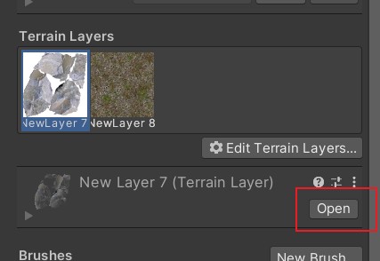

## unity界面使用技巧
1. 将摄像头与所在视角平行
   选择main camera，选择菜单栏的GameObject，选择其中的Align with view即可
2. 物体的中心：
   center:物体的形心（通过计算得到）
   pivot:物体的原点（用来调整物体的位置）
3. 物体的坐标
   local:物体自己的坐标，会跟着物体的旋转而旋转
   global:画布的坐标，不会随着物体的旋转而旋转
4. 锁定层
   在layers中，对于已经做完的层，可以将其锁上，这样可以防止误移该层
5. 让物体按照步长移动
   按住ctrl移动物体
6. 设置步长
   在菜单栏的edit中的snap setting中设置步长
7. 顶点吸附，控制物体紧挨在一块
   按住v键移动物体
8. 创建新场景
   ctrl+n
9. 围绕物体进行观察
   按住alt，再使用左键就可以对物体进行观察
10. 视野选择
   选择此处
   
   persp为透视视野，iso为正交视野
11. 控制物体旋转
   
12. 复制物体
   ctrl+D
13. 

## unity的package manager使用技巧
1. 位置
   
2. 分类：
   
   其中，In Project表示当前项目中的插件，My Assets表示自己下载的资源，往往是从Unity的Assets商店下载的资源，Built-in是内置资源
3. 获取
   - 从Assets商店下载
   - 从第三方库下载
     
     其中，from disk表示将下载到磁盘中的unitypackage导入，from git URL表示直接从github中导入
4. 删除已经安装的插件：
   对于可以在package manager中remove的直接remove，然后点击edit->Preferences->package manager
    
   其中，My Assets中展示的就是通过Assets商店下载下来的插件在磁盘中的位置；
   进入Asset Store-5.x，其中的文件就是下载的插件

## C#脚本技巧
1. 获取GameObject上的某个组件（包括脚本组件）
   ```csharp
   // 以获取Toggle为例
   public GameObject gameObject;
   private Toggle _toggle = gameObject.GetComponent<Toggle>();
   ```
2. 

## 外部资源导入
### 人物模型+动作：
1. 宝藏网站：https://www.mixamo.com/#/   
2. 下载为fbx for unity模式，具体如下：
   
3. 导入后，需要先在assets处编辑模型，首先将Animation type改为Humanoid
   
   skin weights为绑定骨骼时皮肤的一个配重
   点击Apply，就会生成avatar，如果有预定义好的avatar，可以选择CopyFromOtherAvatar，如下：
   
   导入的人物模型其实是有贴图的，但是贴图必需单独解压出来unity才能识别，因此需要在material选项卡中选择extract texture将其解压出来，如下图：
   
   此时会弹出窗口让你Fix Normal Map，这是因为unity中法线贴图必须转化为指定的格式才能使用，因此它会弹出一个弹窗自动帮你把图片转化为法线贴图，直接选择fix now，如下图：
   
   将人物拖拽到项目中后，人物有animator但没有animation controller，因此创建animator controller并拖拽到人物的animator组件的controller框中
   
   之后编辑该animator controller即可
4. 从blender导入的人物模型需要勾选Model中的Bake Axies Conversion选项，因为unity使用左手系坐标，而blender使用右手系坐标，如下：
   

### 从其他软件处导入模型
1. 从3DMAX中导出模型并导入到unity中：
   解决VRAY材质无法随着fbx导出的问题：可查看3dmax笔记中“模型的导入导出”部分
2. 

## 游戏制作技巧
1. 制作prefab
   将游戏中创建的物体拖入project，就可以将该物体变为prefab
   再将prefab拖入scene中就可以生成新的GameObject，且修改prefab就可以修改生成的GameObject
   若直接对生成的GameObject进行修改，该字段会变粗，表示该字段不再受prefab影响
2. 消除GameObject与prefab的关联
   右键该物体，在prefab视图下选择Unpack或Unpack completely
3. 保存场景
   创建Scenes目录，然后ctrl+s保存到Scenes目录下
4. 为了方便设计游戏，可以先将人物放进去，这样可以方便对照人物大小进行设计，一般人物大小为一到两个cube高度
5. 在进行UI设计时，可以勾选2D选项，如图：
   
6. 区分中心与轴心(物体旋转所根据的位置)：
   
   举例：给门包裹一层空物体，然后将门的中心与空物体的中心相差一个门宽的距离，这样当给空物体添加动画（旋转90度即开门）时，门就会绕着门轴旋转90度
7. 

## 创建地形Terrain
1. 创建地形
   GameObject->3D Object->Terrain
2. 地形刷
   选择如下按钮：
   
   然后选择你要做的操作，比如改变地形，如下图所示
   
   然后按住鼠标左键移动即可粉刷地形
   使用Opacity改变地形高度变化的快慢
   按住shift粉刷可以降低地形
   smooth height可以使地形变得平滑
3. 绘制地形贴图
   选择paint texture
   
   然后选择edit terrain layer
   
   选择create layer即可
   可以添加多个贴图，第一个贴图会覆盖整个地面，后面的需要单独粉刷
4. 在添加地形贴图时添加法线贴图
   选择使用的地形贴图，然后点击下方的Open
   
   在norm map中添加法线贴图即可
5. 修改贴图的大小
   选择使用的地形贴图，然后点击下方的Open
   在size处调节贴图大小
6. 添加树和草
   选择Add tree
   
   通过tree density选择密度
   按住shift，再用左键刷可以减少树
   选择Paint details->edit details->add grass texture
   通过Opacity修改草的密度

## camera/light相关操作
1. 调节光的亮度以更容易看清细节
   directional light->indensity->将该值调小
2. directional light：太阳光
   point light: 灯泡
   spot light: 手电筒
3. 光照贴图(light mapping)
   原理：将灯光的阴影提前做出来，然后进行贴图，不需要实时计算灯光效果，这样可以减少性能损耗
   将灯光所在的场景(地形，灯光等)修改为static
   将灯光Object的Mode从Realtime改为Baked(对于火焰光，可以改为Mixed，这样既可以烘焙减少性能损耗，又能提高)
   window->rendering->lighting->settings->generate lighting
4. 火焰效果
   首先建立粒子效果，如下图
   
   创建粒子所对应的材质，修改shader
   shader->mobiles->particles->additive
   将火焰贴图动画粘贴过去，如下图：
    
   将做好的材质指定给粒子系统：选中粒子系统->render->将材质放入其material一栏
   将贴图以动画形式展示：选中粒子系统->texture sheet animation->Tiles改为动画尺寸
   给灯光添加动画：window->animation
5. 控制相机跟随主角移动
   原理：计算出主角和相机的相对距离，然后保持这个距离即可
   先将相机移到离主角合适的位置
   创建脚本，代码如下：
   
6. 通过鼠标控制相机移动（中键控制移动，滚轮控制缩放），代码如下：
   ```csharp
   using System.Collections;
   using System.Collections.Generic;
   using UnityEngine;

   public class MouseOpCameraMovRot : MonoBehaviour
   {
      public enum MouseState
      {
         None,
         MidMouseBtn,
         LeftMouseBtn
      }

      private MouseState _mouseState = MouseState.None;

      private Camera _camera;

      private void Awake()
      {
         _camera = GetComponent<Camera>();   // 获取相机
         if(_camera == null)
         {
               Debug.LogError(GetType() + "camera Get Error");
         }

         GetDefaultFov();
      }

      private void LateUpdate()
      {
         CameraRotate();

         CameraFOV();

         CameraMove();
      }

      #region Camera Rotation

      // 旋转最大角度
      public int yRotationMinLimit = -20;
      public int yRotationMaxLimit = 80;
      // 旋转速度
      public float xRotationSpeed = 250.0f;
      public float yRotationSpeed = 120.0f;
      // 旋转角度
      private float xRotation = 0.0f;
      private float yRotation = 0.0f;

      // 鼠标移动进行旋转
      void CameraRotate()
      {
         if(_mouseState == MouseState.None)
         {
               xRotation -= Input.GetAxis("Mouse X") * xRotationSpeed * 0.02f;
               yRotation += Input.GetAxis("Mouse Y") * yRotationSpeed * 0.02f;

               // 旋转角度y限制修正
               yRotation = ClampValue(yRotation, yRotationMinLimit, yRotationMaxLimit);
               Quaternion rotation = Quaternion.Euler(-yRotation, -xRotation, 0);
               transform.rotation = rotation;
         }
      }

      #endregion

      #region Camera fov

      // fov最大最小角度
      public int fovMinLimit = 25;
      public int fovMaxLimit = 75;
      // fov变化速度
      public float fovSpeed = 50.0f;
      // fov角度
      private float fov = 0.0f;

      // 获取相机的初始视角
      void GetDefaultFov()
      {
         fov = _camera.fieldOfView;
      }

      // 滚轮控制相机视角缩放
      public void CameraFOV()
      {
         // 获取鼠标滚轮的滑动量
         fov += Input.GetAxis("Mouse ScrollWheel") * Time.deltaTime * 100 * fovSpeed;

         // fov限制修正
         fov = ClampValue(fov, fovMinLimit, fovMaxLimit);

         // 改变相机的fov
         _camera.fieldOfView = (fov);
      }
      
      #endregion

      #region Camera Move

      private float _mouseX = 0;  // X方向上鼠标的移动
      private float _mouseY = 0;  // Y方向上鼠标的移动
      public float moveSpeed = 1;

      // 中键控制拖动
      public void CameraMove()
      {
         if(Input.GetMouseButton(2)) // 检测鼠标中键按下的每一帧，0为左键，2为右键
         {
               _mouseX = Input.GetAxis("Mouse X");
               _mouseY = Input.GetAxis("Mouse Y");

               // 相机位置的偏移量（Vector3类型，通过向量的加法得到）
               Vector3 moveDir = (_mouseX * -transform.right + _mouseY * -transform.forward);
         
               // 限制y轴的偏移量
               moveDir.y = 0;
               transform.position += moveDir * 0.5f * moveSpeed;
         } else if(Input.GetMouseButtonDown(2)) // 检测鼠标中键按下的那一帧
         {
               _mouseState = MouseState.MidMouseBtn;
               Debug.Log(GetType() + "_mouseState = " + _mouseState.ToString());
         } else if(Input.GetMouseButtonUp(2))
         {
               _mouseState = MouseState.None;
               Debug.Log(GetType() + "_mouseState = " + _mouseState.ToString());
         }
      }

      #endregion

      #region  tools ClampValue

      // 值范围值限定
      float ClampValue(float value, float min, float max)
      {
         if(value < -360)
               value += 360;
         if(value > 360)
               value -= 360;
         // 限制value的值在min和max之间，如果value小于min，则返回min，如果大于max，则返回max，否则返回value
         return Mathf.Clamp(value, min, max);
      }

      #endregion
   }

   ```
7. 

## 刚体及其运动
1. 添加刚体
   选择物体->在inspector中选择Add component->rigidbody
2. Drag：阻力
   Angular Drag：旋转阻力
   Mass：惯性，质量越大，惯性越大
3. 添加碰撞器
   选择物体->在inspector中选择Add component->xx collider
   注：一般unity自带的物体（sphere,cube等）会有自己的碰撞器
   collider种类：
   box collider
   sphere collider
   capsule collider
   mesh collider等
   其中mesh collider最耗费性能，因为它会根据物体创建网格，添加mesh collider时需要与mesh filter保持一致
4. 添加碰撞函数
   对已经添加碰撞器的物体添加脚本，在脚本中创建一个函数，如下：
   
   注：两个静态Collider无法发生碰撞
5. 获取对方的碰撞器，名字，tag
   
6. 添加触发器（触发器与碰撞器的区别在于，触发器是可穿透的，碰撞器是不可穿透的）
   将碰撞器变为触发器
   
   添加触发函数
   

## 导航系统
1. 确保Unity中有AI Navigation
   如何下载：window->package manager->将根目录改为unity registry->查找AI Navigation并下载
2. 导航网格烘焙
   (1)window->ai->navigation(obsolete)
   (2)确保环境(包括地形，障碍物灯)的navigation static被勾选上：选中环境，在navigation(obsolete)中选择object选项卡，将navigation static选中
   (3)在bake选项卡中选择bake
   
3. 其他事项
   navigation static弃用：
   
   让某物可以穿过：将该物体的navigation static取消掉，重新烘焙
   让可行走区域更靠近障碍物：选中该物体，在navigation(obsolete)中，选择bake选项卡，将agent radius值调小，重新烘焙
   让某物上方也不可行走：选中该物体，在navigation(obsolete)中，选择object选项卡，将navigation area选为not walkable，重新烘焙
4. 给主角添加nav mesh agent组件
5. 添加脚本控制主角移动
   创建脚本，将脚本赋给主角Object
   通过鼠标点击获取位置原理：鼠标点击某个点，在这个点发射射线，让射线与地面某个点发生碰撞，然后获取这个点的位置即可。这种情况下点击环境外的位置无法获取位置，因为无法发生碰撞。代码如下：
   
   控制角色到达点击的位置原理：将角色的nav mesh agent改为点击的位置，AI通过导航网格可以自动避开障碍物，到达指定位置。代码如下：
   
   将nav mesh agent组件拖拽到定义的agent变量中
   修改nav mesh agent的angular speed可以提高人物转向的速度

## 动画
1. 给角色添加动画(待机，走路，跑步等)
   创建一个animator controller
   将该controller赋值给hero的animator组件
   选中hero->打开window->animation->animator
   将idle动作先放入编辑区(成为默认动作)，如图：
   
   再将walk,run两个动作放入animator编辑区
   添加参数speed，如下图：
   
   添加从idle到walk的转换线，选中转换线，点击+号将speed参数添加到Conditions中，再将speed条件改为大于等于0，如下图：
   
   再添加从walk到idle的转换线，选中转换线，将speed条件改为小于0
   选中转换线，将HasExitTime取消，因为动作的切换可能随时发生
   
   run和walk的转换同理
   由于自己定义的speed参数不会自动赋值，需要在角色控制的脚本中(hero.cs)进行赋值，代码如下：
   
2. 给动画添加曲线（如小球从下落到弹起的过程中速度的变化）
   打开Animation窗口，点击要编辑的物体，会自动显示绑定在该物体上的动画(关键帧序列)，点击下方的Curve按钮进入曲线界面，如下：
   
   缩放曲线y轴：按住shift+滑动鼠标滚轮
   缩放曲线x轴（时间）：滑动滚轮
   曲线上有一些关键点，如图：
   
   每个关键帧对应曲线上的关键点
   添加关键点：双击曲线上某个点（也将在这条曲线对应的属性的时间轴上添加关键帧）
   删除关键点：框选该点，按下delete键即可删除
   选中关键点（框选），右键即可对点进行编辑
3. 给动画转换添加trigger，与1中添加speed类似
   例如添加当用户靠近时开门的动作：添加一个PlayerProximited参数，然后将DoorClosed到DoorOpen两个动画之间的连线的HasExitTime取消勾选，并添加上这个trigger，最后给门添加碰撞体积，当碰撞时就让trigger触发
4. 添加碰撞体：详见刚体及其运动一章
5. 控制动画不循环播放：找到动画的animation，将Loop Time的勾选取消即可
   
6. 

## UGUI基础
1. 创建canvas：
   
   将Scene区域的视图改为2D
   
2. 文本控件
   字体导入：
   创建文件夹fonts，将ttf文件放入fonts，点击Text游戏物体，在font assets中选择新导入的字体
   
3. 图片控件
   在assets中创建texture文件夹，将需要的图片放入，同时将图片中texture type改为Sprite(2D and UI)
   
   将图片拖入图片控件的source image栏中
   图片控件中的Raycast Target勾选上表示，当鼠标的射线碰撞到图片时，会触发事件
4. 按钮控件
   按钮控件的按钮组件中可以设置按钮不同状态下的颜色(按下，选中等)
   按钮组件中还有一个OnClick部分可以设置按下按钮后触发的事件，这里先选择点击后要影响的游戏物体，然后选择方法
   创建按钮控件也可以先创建图片控件，再在图片控件中添加按钮组件，这样可以让按钮点击后对其他物体产生影响
   注：按钮控件的OnClick的函数可以添加参数，但只允许添加一个参数
5. 锚点
   控件相对位置的参考点，控件的小圆圈就是控件的原点，所谓相对位置就是锚点与控件原点的相对位置
   对于背景图，为了避免图片因为界面尺寸的变化而变化，要将image的锚点设置为界面的四个角
   
6. 输入框控件
   对于输入框控件，如果希望输入内容为密码类型（*号表示），选中输入框控件，将content type改为password
   C#获取输入框内容：首先编写如下脚本，然后将输入框控件拖入InputField对象
   
7. 单选按钮控件
   选择Toggle控件
   将多个单选按钮变为一组（例如多选一的情况），则先将多个单选框用一个空物体包裹起来，然后在空物体上添加Toggle Group组件，并将该空物体赋值给每个单选按钮的IsOn下方的Group变量
   注：Toggle中，IsOn下方的Gaphic存放的就是勾选中后出现的物体（比如勾勾）
      当物体被选中时，会触发IsOn下方的OnValueChanged设置的函数
8. 滑动器（slider）
   设置边框（对于按钮或者滑动器，当进行拉伸时，希望边缘不被影响，只是长度变长，就需要设置边框）：
   首先若没有安装边框编辑器，需要在Package Manager中安装2D Sprite
   
   点击图片->点击Sprite Editor->设置边框->点击Apply
   再将图片应用于滑动器即可
   滑动器还可以修改填充方式，将
9. 滚动器（scroll bar） 
10. 下拉菜单（drop box）
11. 面板(Panel)

## UGUI技巧
1. UI设计原则：UI的层级关系应该与UI特效分开，即触发UI特效的物体不必是最外层的物体
2. 对于button，如果希望触发该button的图片来自别的地方（比如在button上方的图层），可以通过修改Target Graphic为button上方图层来改变
3. 创建新场景：file->new scene->save scene as
4. 制作血条技巧：创建一个背景Bar,再Bar在里面创建一个空槽Bar，再在空槽Bar上创建一个血条Bar，然后给背景Bar添加slider组件，将sldier的Fill rect设置为血条bar，将Slider的interactive的勾选去掉
5. 技能冷却效果技巧：创建一个边框图片，再在边框图片下加一个技能图标1，然后复制这个图标得到技能图标2，将技能图标2改为深色，并勾选Maskable，然后将其Image Type改为Filled，就可以通过修改值获得技能冷却效果，如下图：
   
6. 给字体加阴影：给text控件加Shadow
7. 给字体加边框：给text控件加Outline
8. 通过名字寻找寻找子物体(该子物体为Image对象)：
   
9. 获取键盘敲击事件(aplha1为数字1)：
   
   注意：应将该程序段置于Update函数中，这样才可以随时监听
10. 让子物体和父物体的宽高保持一致，即父物体宽高变化，子物体的宽高也跟着变化：将子物体的锚点设置为父物体的四角
11. 让物体以网格状排列：新建一个空物体，在空物体中添加GridLayoutGroup组件，则在空物体中添加的物体将会以网格方式排列
12. 场景复用：将场景中需要的东西变成prefab，即将scene中需要的物体放到assets中，就可以在别的场景中复用了
13. 让列表滑动起来：创建一个空物体，让他与列表的一页保持一致，命名为Window->将列表置于Window中->给Window添加ScrollRect组件->ScrollRect组件中content一栏设置为该列表，这样就可以实现列表滑动
    注：若希望只能上下滑动，则只勾选Vertical；若希望只能左右，则只勾选Horizontal；
        ScrollRect只有在滑动图片等对象时才能触发，因此，滑动空白区域不会使列表滑动，可以在Window上添加一个Image组件，这样就可以滑动了，如图：
   
14. 获取滑动列表滑动的位置：
    在12所建的window中添加脚本，在脚本中定义OnValueChanged函数，如下图。并将该函数赋值给window的Scroll Rect组件的OnValueChanged一栏，这样当滑动列表时，window就会调用该函数。
    
15. 在拖拽列表结束时将列表停在最近一页上：
    整体逻辑同13，不需要将函数指定给ScrollRect组件，但需要保证该脚本能够获得ScrollRect组件。代码如下：
   ```csharp
   using System.Collections;
   using System.Collections.Generic;
   using UnityEngine;
   using UnityEngine.EventSystems;
   using UnityEngine.UI;

   public class NewBehaviourScript : MonoBehaviour, IBeginDragHandler, IEndDragHandler
   {

      private ScrollRect scroll;
      private float[] pageKnot = new float[]{0, 0.3333f, 0.6666f, 1};
      private float targetPos = 0;
      private bool isMoving = false;  // 是否还需要平滑移动，即当当前位置与targetPos距离足够小时，直接将滑动列表的距离设置为targetPos
      private float speed = 7;    // 设置滑动速度

      // Start is called before the first frame update
      void Start()
      {
         scroll = GetComponent<ScrollRect>();    // 获取该物体的ScrollRect组件
      }

      // Update is called once per frame
      void Update()
      {
         if(isMoving)
         {
               // Time.deltaTime即为增量时间，其值为1s/1s内的帧数
               scroll.horizontalNormalizedPosition = Mathf.Lerp(scroll.horizontalNormalizedPosition, 
                  targetPos, Time.deltaTime * speed);   // Lerp是插值函数，用于在两个点之间插值，通过该函数实现平滑移动
               if(Mathf.Abs(scroll.horizontalNormalizedPosition - targetPos) < 0.001)
               {
                  scroll.horizontalNormalizedPosition = targetPos;
                  isMoving = false;   //停止平滑移动
               } 
         }
      }

      public void OnBeginDrag(PointerEventData eventData)
      {

      }

      public void OnEndDrag(PointerEventData eventData)
      {
         float curPos = scroll.horizontalNormalizedPosition; // 得到滑动组件当前的水平位置正则化的结果
         int index = 0;
         float offset = curPos - pageKnot[0]; // 获取当前水平正则位置与第0页的距离
         for(int i = 1; i < 4; i++)
         {
               if(Mathf.Abs(curPos - pageKnot[i]) < offset) // 获取当前水平正则位置与其他页的距离，并找到距离最近的点
               {
                  index = i;
                  offset = Mathf.Abs(curPos - pageKnot[i]);
               }
         }

         targetPos = pageKnot[index];
         isMoving = true;    // 当用户滑动结束后，且确定最终将停在哪一页后，就开始平滑移动
      }
   }

   ```
16.   

## 天气盒子
### UniStorm使用
1. 导入包->window->unistorm->create weather system
   
   注意需要给Camera添加Main Camera的tag，以及给Terrain添加Player的Tag，因为unistorm通过这两个tag来确定渲染的位置和大小
2. 控制天气变化：
   创建一个新的空物体命名为UniStormController，添加脚本，在脚本中添加函数，代码如下：
   
   然后创建一个UI，添加几个button，每个button表示一种天气，然后将UniStormController拖入button的OnClick，将WeatherChange函数传入，
   在UniStorm的AllWeatherType通过索引获取需要的天气，则给函数传入特定索引值，如下：
   
   
3. 控制时间变化
   前几步同2，在脚本中添加函数，代码如下：
   
   创建一个ScrollBar，将UniStormController拖入ScrollBar的OnValueChanged，将DayTimeChange函数传入即可，UniStorm将0-1之间的小数转化为‘小时-分钟’
4. 